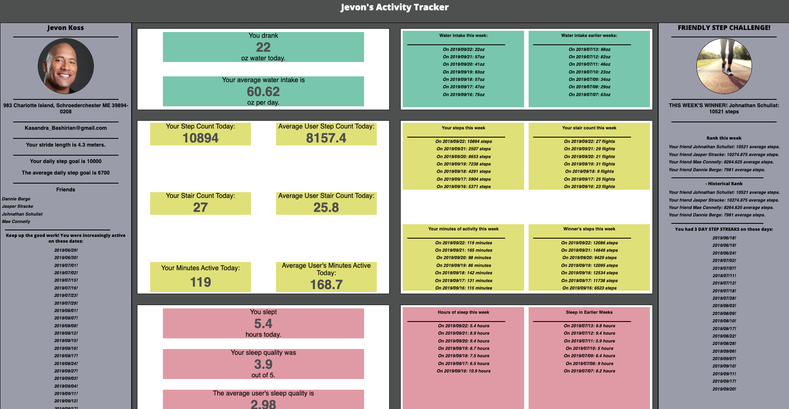

[![Contributors][contributors-shield]][contributors-url]
[![Forks][forks-shield]][forks-url]
[![Stargazers][stars-shield]][stars-url]
[![Issues][issues-shield]][issues-url]

<br />
<p align="center">
  <a href="https://github.com//DougieDev/refactor-fitlit-B">
    
  </a>

  <h3 align="center">FitLit</h3>

  <p align="center">
    <br />
    <a href="https://github.com//DougieDev/refactor-fitlit-B">View Demo</a>
  </p>
</p>

## Table of Contents

* [About the Project](#about-the-project)
  * [Built With](#built-with)
* [Getting Started](#getting-started)
  * [Prerequisites](#prerequisites)
  * [Installation](#installation)
  * [Running App](#running-site-locally)
* [Usage](#usage)
* [Roadmap](#roadmap)
* [Contact](#contact)
* [Acknowledgements](#acknowledgements)


<!-- ABOUT THE PROJECT -->
## About The Project

This was the final group project of module 2 for the Turing School of Software and Design. We were tasked with taking an old student project and refactoring it's code base while implementing API get and post. This is was our starting point: 



One of our primary focuses was to increase UX design. In the beginning we were faced with large lists of dates, and data the user could not interact with. We ended up focusing on ways to categorize the data and allow the user to find specific information easily. 


### Built With

* [Sass](https://sass-lang.com/)
* [Moment.js](https://momentjs.com/)
* [JavaScript](https://www.javascript.com/)
* [Web-pack](https://webpack.js.org/)
* [Pikaday.js](https://pikaday.com)
* [Chai / Spies](http://chaijs.com)

<!-- GETTING STARTED -->
## Getting Started


### Prerequisites

* npm
```sh
npm install npm@latest -g
```

### Installation

1. Clone the repo
```sh
git clone https://github.com/your_username_/Project-Name.git
```
2. Install NPM packages
```sh
npm install
```
If you still have missing packages, run: 
```
npm install moment --save
npm install pikaday --save
``` 

### Running Site Locally

1. In Terminal:
```sh
npm start
```
2. In Browser:
Go to `http://localhost:8080/` in your browser to view your code running in the browser.


<!-- USAGE EXAMPLES -->
## Usage

FitLit is an app for people who want to keep track of their health over time. It allows them to post metrics about their sleeping and hydration habits, as well as track daily physical activity.

We experimented with iterating over DOM elements instead of calling each specific value. This allowed us to work our way through a parent element and insert data (or input forms) based on keywords in element ids and class names. Because of this we were able to use one function to populate Daily Cards from different sets of data, and each day of the week, with one block of code.

```
  populateDailyData(card, repo, userId, date) {
    let location = document.getElementById(card);
    const innerElements = location.children;
    for (var i = 0; i < innerElements.length; i++) {
      let key = innerElements[i].id.split('-')[0]
      if (innerElements[i].classList.contains('number') 
      && innerElements[i].id.includes('average')) {
        innerElements[i].innerText = repo.calculateAverage(key, userId);
      } else if (innerElements[i].classList.contains('number')) {
        innerElements[i].innerText = repo.findById(userId, date)[key];
      }
    }
  }
```

This strategy was also particularly helpful when gathering a User's new data to POST to the server. We found that since we had a framework designed to receive and sort data, that we were able to easily pull that data, and sort it back into an object that would be received well by the server. In particular, it allowed us to create a form for the user which would post to each data-set at once, rather than having three separate forms.

<!-- ROADMAP -->
## Roadmap

* Allow the pikaday calendar to have color-coding and better styling
* Create more opportunities for users to interact with friends
* Continue to develope a brand / style

<!-- CONTACT -->
## Contact

### Greyson Elkins - [GitHub](https://github.com/greysonelkins/) - [LinkedIn](https://www.linkedin.com/in/greyson-elkins/) - greysonelkins@gmail.com

### Joshua Sevy - [GitHub](https://github.com/joshsevy/) - [LinkedIn](https://www.linkedin.com/in/joshua-sevy/) - joshuasevy@outlook.com

### Carlyle Douglas - [GitHub](https://github.com/DougieDev) - [LinkedIn](https:/www.linkedin.com/in/carlyle-douglas-9b812490/) - cdouglascorp@gmail.com

Your Name - [@your_twitter](https://twitter.com/your_username) - email@example.com

Project Link: [Refactor-FitLit-B](https://github.com//DougieDev/refactor-fitlit-B/issues)


<!-- ACKNOWLEDGEMENTS -->
## Acknowledgements
* [Turing School of Software & Design](https://turing.io/)
* [moment.js](https://momentjs.com/)
* [Img Shields](https://shields.io)
* [GitHub Pages](https://pages.github.com)
* [Font Awesome](https://fontawesome.com)
* [Mocha](https://mochajs.org/)
* [Chai](https://www.chaijs.com/)


<!-- MARKDOWN LINKS & IMAGES -->
<!-- https://www.markdownguide.org/basic-syntax/#reference-style-links -->
[contributors-shield]: https://img.shields.io/github/contributors/DougieDev/refactor-fitlit-B.svg?style=flat-square
[contributors-url]: https://github.com/DougieDev/refactor-fitlit-B/graphs/contributors
[forks-shield]: https://img.shields.io/github/forks/DougieDev/refactor-fitlit-B.svg?style=flat-square
[forks-url]: https://github.com/DougieDev/refactor-fitlit-B/network/members
[stars-shield]: https://img.shields.io/github/stars/DougieDev/refactor-fitlit-B.svg?style=flat-square
[stars-url]: https://github.com/DougieDev/refactor-fitlit-B/stargazers
[issues-shield]: https://img.shields.io/github/issues/DougieDev/refactor-fitlit-B.svg?style=flat-square
[issues-url]: https://github.com/DougieDev/refactor-fitlit-B/issues

